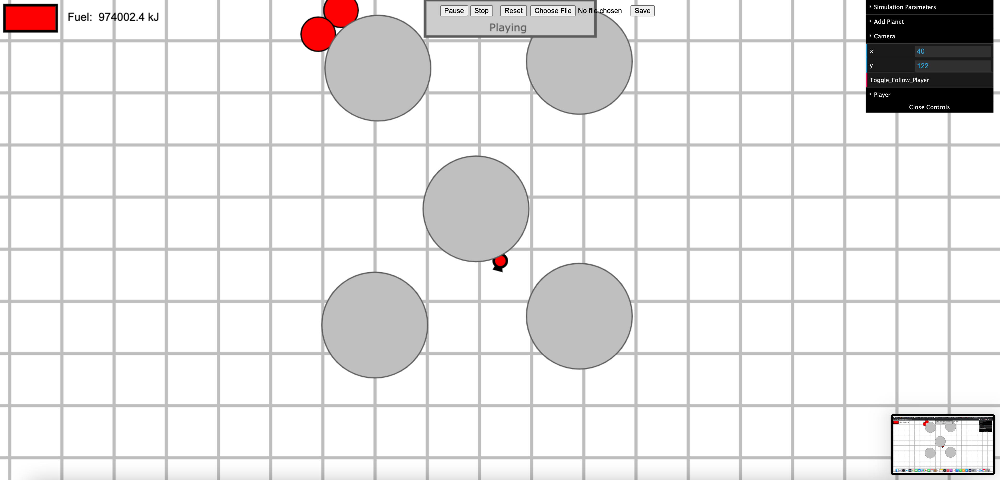

# Rocketry

https://asuradev99.github.io/rocketry/

- A simple and light two-dimensional gravitation simulator featuring a controllable rocket and a planet editor
- Specifically designed to run on Chromebooks and other computationally-challenged devices
- Load and save configurations to create and share levels and configurations on the fly

## Controls

| Key      | Function |
| :----------- | -----------: |
| `w / s`      | Zoom in / out      |
| `space`| Play/pause the simulation while it is running|
| `x` | Delete the selected object (Only in Editor mode)|
| `LM Drag` | Drag the camera (only in Editor mode) |
| `Right Arrow / Left Arrow` | Turn the rocket right/left (Only in Player mode) |
| `Up Arrow` | Accelerate the rocket (Only in Player mode) |
| `f` | Toggle force and velocity vectors for dynamic entities |

## Settings Explanation

| Name      | Function |
| :----------- | -----------: |
| `gravitationalConstant`      | strength of the gravitational force between massive objects      |
| `deltaT`   | Speed of the simulation (faster = less accurate)     |
| `newPlanetMass`| Set the mass of the new planet (yes, it can be negative)|
| `isDynamic`| If checked, the planet is dynamic and can accelerate based on it's attraction to other planets and dynamic entities.|
| `Add_Planet` | Add a new planet (Only in Editor mode)|
| `Camera x/y` | Camera x and y coordinates (only in Editor mode) |
| `Toggle Follow Player` | Toggle whether the camera follows the player or can move around freely |
| `Toggle Show Velocity` | Show the velocity vectors of moving objects |
| `Toggle Show Forces` | Show the forces acting on objects with mass |
| `Toggle Trace Positions` | If true, tracks the player's (and other moving entities') positions over time using markers. |

## Tips and Tricks
- In the Editor mode, click on an object to edit its properties. 
- In any GUI, to quickly increase or decrease a numerical property, click on the textbox with the number in it and drag the cursor up/down to increase/decrease the value. 
- In Play mode, you will notice that you can still accelerate and rotate the player while the game is paused. This mechanism is deliberate, and is designed to allow you to make precise maneuvers. The `f` control is very useful while this mechanic is being used, as you can see how accelerating the rocket in a certain direction affects its velocity without the simulation progressing. 
