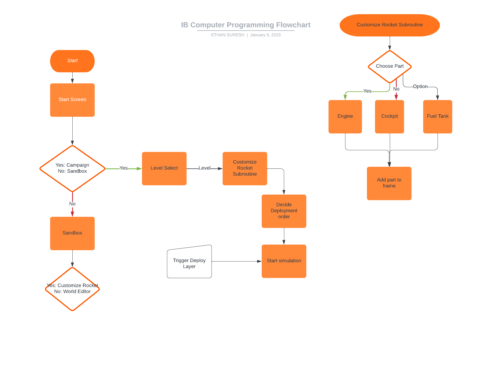

# CP2-Project

Because I am going to do a Computer Programming Internal Assessment I need to meet with a client first before I decide what my project will be. 

## Possible Ideas
-- Player can increase their velocity and modify their angle when the game is paused (this allows for very precise maneuvers, facilitating the use of calculation)
-- physical "checkpoints" or areas that the players must enter  in order to win the level
-- Planets have atmospheres with friction 
-- 
